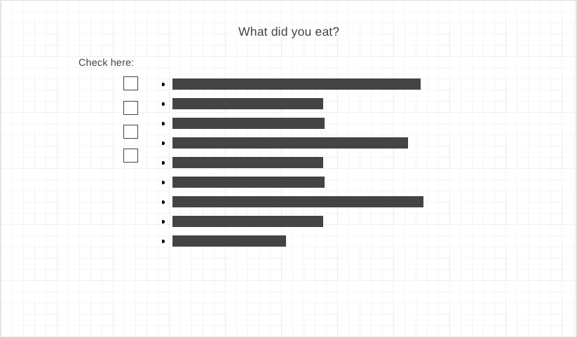
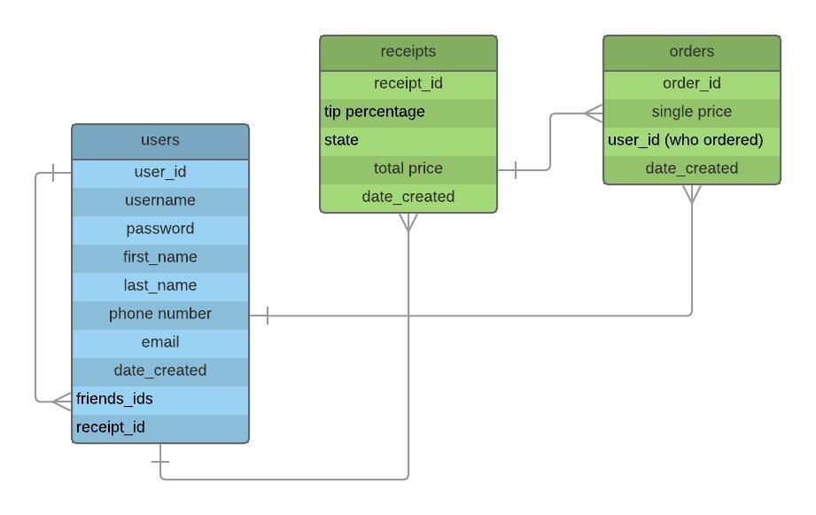

# vPay
Backend: (https://github.com/tongsalex/vpay-backend)
## Usage
```npm install```  
```npm run dev```  
Navigate to http://localhost:3000 in your web browser
## Concept
vPay is an web application that allows users to upload a photo of a restaurant receipt and split the bill among users by food ordered, tip and tax percentage. It allows user login with authentication, and stores each user's receipt and order history in a Postgres database. It uses the Taggun API to obtain the receipt text, and the PayPal API to handle payments between users. 
## Technology
Frontend:  
* React.js
* Redux
* EJS
* Paypal Rest SDK
* HTML
* CSS
* Axios
  
Backend:  
* Node
* Express
* PostgreSQL
* Sequelize
* Passport
* CORS
* Cookie Parse

### User Story
- Create an account and log in  
- Land on a visually pleasing homepage that displays order and receipt history
- Upload a receipt 
- Add users by username and create orders by dragging food items to different users
- Log in to PayPal and pay off an indivudal order
- Cash out their balance

### Visuals


### Wireframes
#### Login/Signup Page

#### Dashboard

#### Add users to receipt

#### What did you eat on this order?


### ERD


### Project Time Frame Given: 8/14-8/23

### Key Challenges (and Proof of Concept)

### Sources
1. https://programmingwithmosh.com/javascript/react-file-upload-proper-server-side-nodejs-easy/
